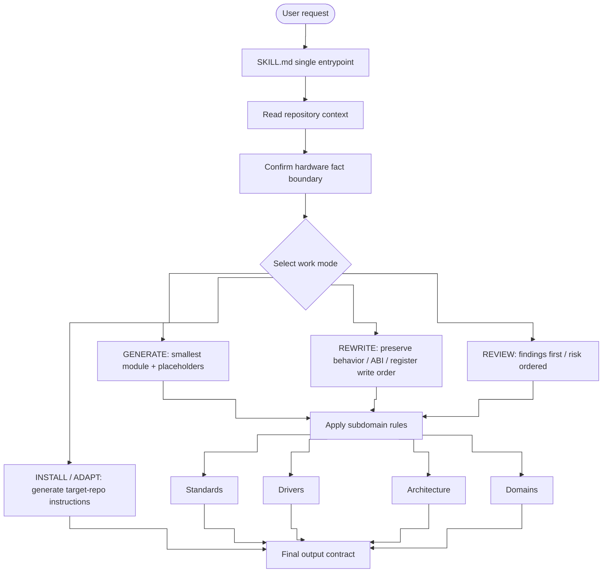

# embedded-code-skill

<p align="center">
  
  
  
  
  
</p>

> Embedded C code assistant for driver skeletons, legacy-code cleanup, low-level firmware review, and adapting one rule set to different IDE or agent environments.

[简体中文](README.md) · [English](README_EN.md) · [日本語](README_JP.md)

---

## What This Repository Is

This repository now has one rule entrypoint: `SKILL.md`.

`SKILL.md` combines the former core skill, subdomain rules, IDE adaptation rules, and reference guidance. It helps the model produce stable, conservative, reviewable output when:

- writing new Embedded C driver skeletons
- cleaning up legacy driver, HAL/BSP, or register-access code
- reviewing ISR, DMA, cache, volatile, race, timeout, and overflow risks
- adapting to repository-local status types, naming, vendor SDKs, and build macros
- extracting the same rules for Cursor, VS Code, Claude-compatible agents, or `AGENTS.md`

It is **not** a substitute for a vendor reference manual, real register map, IRQ table, barrier rule, cache/DMA rule, timing requirement, or certification artifact.

---

## Quick Start

```bash
/ecs Generate an STM32 UART driver skeleton, base address 0x4000C000
/ecs Clean up this SPI init code, preserving register write sequence
/ecs Review this DMA ISR for race, volatile, or cache issues
/ecs Generate Cursor .cursor/rules/*.mdc rule content
```

---

## Work Modes

| Mode | Purpose |
|------|---------|
| `GENERATE` | Write the smallest maintainable module; use labeled placeholders when hardware facts are missing |
| `REWRITE` | Clean up code while preserving public behavior, ABI, register write order, and timing-sensitive sequences |
| `REVIEW` | Lead with findings; prioritize correctness, hardware behavior, races, and portability risk |
| `INSTALL` / `ADAPT` | Convert `SKILL.md` guidance into target IDE or agent instruction files |

---

## Skill Architecture

`SKILL.md` is the single entrypoint. Its structure is organized as request classification, repository context, work mode, subdomain rules, and output contract.



---

## Capability Matrix

| Layer | Coverage |
|-------|----------|
| Entry | Single `SKILL.md` with frontmatter, scope, trigger intent, and operating principles |
| Context | Local headers, macros, status types, naming, SDKs, build flags, and existing drivers |
| Fact boundary | Label values as `USER_PROVIDED`, `REPO_DERIVED`, or `PLACEHOLDER`; do not guess hardware details |
| Work modes | `GENERATE`, `REWRITE`, `REVIEW`, `INSTALL`, `ADAPT` |
| Output contracts | Separate response shapes for generated code, rewrites, review findings, and IDE instructions |
| Coding standards | Naming, types, error handling, struct patterns, comments, and dynamic-allocation limits |
| Driver templates | UART, SPI, I2C, DMA, CAN, GPIO, Timer, Watchdog, MIL-STD-1553 |
| Architecture rules | Cortex-M, Cortex-A, PowerPC, SPARC V8, RISC-V, and unknown-architecture handling |
| Domains | Aerospace, military, industrial safety, automotive functional safety, general embedded |
| Review checklist | Hardware sources, register access, concurrency, behavior preservation, IDE-rule conflicts |
| Maintenance check | After skill edits, run manual smoke checks for generate, rewrite, review, adapt, and domain scenarios |

---

## Core Rules

| Category | Rule |
|----------|------|
| Repo first | Reuse existing status types, naming, SDKs, include order, and build macros |
| Hardware facts | Do not invent register offsets, bit fields, reset values, IRQs, barriers, or timing requirements |
| Output contract | Generate, rewrite, and review modes each have an IDE-friendly response shape |
| Types | Prefer fixed-width integers and `bool` in public interfaces |
| Error handling | Use `embedded_code_status_t` only when the project has no local convention |
| Register access | Use dedicated register definitions or existing vendor/CMSIS structs |
| Memory | Avoid dynamic allocation and VLAs in low-level drivers by default |
| Concurrency | Treat ISR, DMA, cache, critical sections, and memory ordering conservatively |

---

## Subdomain Coverage

`SKILL.md` includes these four subdomain rule sets directly. They are no longer split into separate directories.

### Standards

- Naming, pointer naming, fixed-width types, and `bool`
- Fallback status type: `embedded_code_status_t`
- Config structs, runtime handles, and state enums
- Magic numbers, buffer sizes, timeouts, retry counts, comments, and review checklist

### Drivers

- Common structure: `*_reg.h`, `*_reg_t`, `*_REG`, `MASK/SHIFT`
- Covers UART, SPI, I2C, DMA, CAN, GPIO, Timer, Watchdog, and MIL-STD-1553
- Includes minimal register-field references, bit naming examples, GPIO modes, and MIL-STD-1553 mode/message types
- Treats templates as organization examples only; real offsets, reserved bits, reset values, and errata must come from target sources

### Architecture

- Covers ISRs, barriers, DMA, cache, interrupt controllers, SMP, memory ordering, and CSR/SPR access
- Includes Cortex-M, Cortex-A, PowerPC, SPARC V8, and RISC-V quick refs
- Includes PowerPC / SPARC / RISC-V wrapper examples
- For unknown architectures, require source material; otherwise generate architecture-neutral skeletons with placeholders

| Architecture | Interrupts | Barrier / Sync | Special Registers |
|--------------|------------|----------------|-------------------|
| Cortex-M | NVIC | `__DMB()`, `__DSB()`, `__ISB()` | N/A |
| Cortex-A | GIC | `dmb ish` | system registers |
| PowerPC | PIC | `msync` | `mfspr` |
| SPARC V8 | INTC | `stbar` | `rd psr` |
| RISC-V | PLIC/CLINT | `fence` | `csrr` |

### Domains

- Covers Aerospace / DO-178C, Military / MIL-STD, Industrial / IEC 61508, and Automotive / ISO 26262
- Includes keyword detection, focus areas, default expectations, and safety-review priorities
- Does not treat DAL, ASIL, SIL, MC/DC, SPFM, LFM, or BIT coverage as universal defaults

---

## Adapting To IDEs Or Agents

Use `SKILL.md` as the single source, then extract the core rules for the target tool:

These paths are **generated in the target repository**. They are not bundled files in this repository.

- Cursor: `.cursor/rules/*.mdc`
- VS Code / Copilot: `.github/copilot-instructions.md`
- VS Code scoped instructions: `.github/instructions/*.instructions.md`
- Claude-compatible agents: `CLAUDE.md`
- Generic agents: `AGENTS.md`

Prefer one always-on instruction file per target repository to avoid duplicated guidance.

---

## Package Layout

```text
embedded-code-skill/
├── SKILL.md
├── README.md
├── README_EN.md
└── README_JP.md
```

---

## License

MIT License
