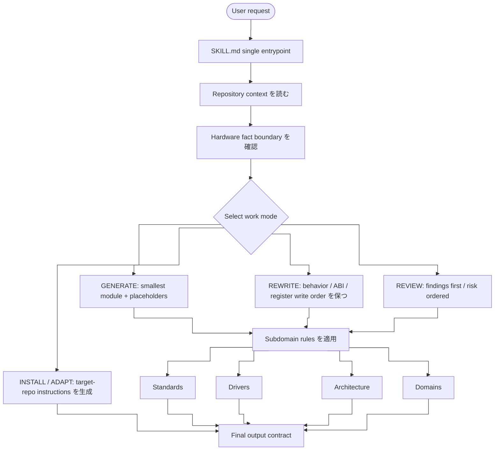

# embedded-code-skill

<p align="center">
  
  
  
  
  
  
</p>

> ドライバ骨格の作成、既存コードの整理、低レベルファームウェアのレビュー、IDE / agent 向けルール調整に使う Embedded C コード助手。

[简体中文](README.md) · [English](README_EN.md) · [日本語](README_JP.md)

---

## このリポジトリについて

このリポジトリのルール入口は `SKILL.md` だけです。

`SKILL.md` には、以前分かれていた core skill、子領域ルール、IDE 向け調整ルール、参考情報を統合しています。主に次の作業で、モデルの出力を安定させ、保守的でレビューしやすくします。

- 新しい Embedded C ドライバ骨格を書く
- 既存の driver、HAL/BSP、register-access code を整理する
- ISR、DMA、cache、volatile、race、timeout、overflow のリスクをレビューする
- リポジトリ既存の status type、命名、vendor SDK、build macros に合わせる
- 同じルールを Cursor、VS Code、Claude 互換 agent、または `AGENTS.md` 向けに取り出す

これはベンダーのリファレンスマニュアル、実際のレジスタマップ、IRQ、barrier、cache/DMA ルール、タイミング要件、認証資料の代替ではありません。

---

## クイックスタート

```bash
/embedded-code-skill STM32 UART ドライバを生成、ベースアドレス 0x4000C000
/embedded-code-skill この SPI 初期化コードを整理し、レジスタ書き込み順序を保つ
/embedded-code-skill この DMA ISR の race、volatile、cache 問題をレビューする
/embedded-code-skill Cursor .cursor/rules/*.mdc 向けのルール内容を生成する
```

---

## 作業モード

| モード | 用途 |
|--------|------|
| `GENERATE` | 最小で保守しやすい module を書く。hardware facts が足りない場合は placeholder を明示する |
| `REWRITE` | public behavior、ABI、register write order、timing-sensitive sequence を保って整理する |
| `REVIEW` | finding を先に出し、correctness、hardware behavior、race、portability risk を優先する |
| `INSTALL` / `ADAPT` | `SKILL.md` のルールを対象 IDE / agent の指示ファイルに変換する |

---

## Skill アーキテクチャ

`SKILL.md` は単一入口です。構成は、request classification、repository context、work mode、subdomain rules、output contract の順に整理しています。



---

## 機能マトリクス

| レイヤー | カバー範囲 |
|----------|------------|
| Entry | frontmatter、scope、trigger intent、operating principles を含む単一 `SKILL.md` |
| Context | local headers、macros、status types、naming、SDKs、build flags、existing drivers |
| Fact boundary | `USER_PROVIDED`、`REPO_DERIVED`、`PLACEHOLDER` を明示し、hardware details を推測しない |
| Work modes | `GENERATE`、`REWRITE`、`REVIEW`、`INSTALL`、`ADAPT` |
| Output contracts | generated code、rewrite、review findings、IDE instructions の出力形 |
| Coding standards | naming、types、error handling、struct patterns、comments、dynamic allocation limits |
| Driver templates | UART、SPI、I2C、DMA、CAN、GPIO、Timer、Watchdog、MIL-STD-1553 |
| Architecture rules | Cortex-M、Cortex-A、PowerPC、SPARC V8、RISC-V、unknown architecture handling |
| Domains | Aerospace、military、industrial safety、automotive functional safety、general embedded |
| Review checklist | hardware sources、register access、concurrency、behavior preservation、IDE-rule conflicts |
| Maintenance check | skill 変更後に generate、rewrite、review、adapt、domain scenarios の smoke check を行う |

---

## コアルール

| 分類 | ルール |
|------|--------|
| リポジトリ優先 | 既存の status type、命名、SDK、include order、build macros を優先する |
| ハードウェア事実 | register offset、bit field、reset value、IRQ、barrier、timing を捏造しない |
| 出力形式 | generate、rewrite、review それぞれに IDE で扱いやすい形を使う |
| 型 | public interface では固定幅整数と `bool` を優先する |
| エラー処理 | プロジェクトに規約がない場合のみ `embedded_code_status_t` を使う |
| レジスタアクセス | 専用定義または既存の vendor/CMSIS 構造体を使う |
| メモリ | 低レベルドライバでは動的確保と VLA をデフォルトで避ける |
| 並行性 | ISR、DMA、cache、critical section、memory ordering は保守的に扱う |

---

## 子領域のカバー範囲

`SKILL.md` には、次の 4 つの子領域ルールを直接組み込んでいます。現在は別ディレクトリには分けていません。

### Standards

- 命名、pointer naming、固定幅型、`bool`
- fallback status type: `embedded_code_status_t`
- config struct、runtime handle、state enum の構成
- magic number、buffer size、timeout、retry count、コメント、review checklist

### Drivers

- 共通構成: `*_reg.h`、`*_reg_t`、`*_REG`、`MASK/SHIFT`
- UART、SPI、I2C、DMA、CAN、GPIO、Timer、Watchdog、MIL-STD-1553 をカバー
- 最小 register field、bit naming 例、GPIO mode、MIL-STD-1553 mode/message type を含む
- template は構成例であり、実際の offset、reserved bit、reset value、errata は対象資料に従う

### Architecture

- ISR、barrier、DMA、cache、interrupt controller、SMP、memory ordering、CSR/SPR をカバー
- Cortex-M、Cortex-A、PowerPC、SPARC V8、RISC-V の quick ref を含む
- PowerPC / SPARC / RISC-V wrapper 例を含む
- 未知アーキテクチャでは資料を要求し、確認できない場合は architecture-neutral skeleton と placeholder に留める

| Architecture | Interrupts | Barrier / Sync | Special Registers |
|--------------|------------|----------------|-------------------|
| Cortex-M | NVIC | `__DMB()`, `__DSB()`, `__ISB()` | N/A |
| Cortex-A | GIC | `dmb ish` | system registers |
| PowerPC | PIC | `msync` | `mfspr` |
| SPARC V8 | INTC | `stbar` | `rd psr` |
| RISC-V | PLIC/CLINT | `fence` | `csrr` |

### Domains

- Aerospace / DO-178C、Military / MIL-STD、Industrial / IEC 61508、Automotive / ISO 26262 をカバー
- keyword detection、focus areas、default expectations、safety-review priorities を含む
- DAL、ASIL、SIL、MC/DC、SPFM、LFM、BIT coverage を汎用デフォルトとして扱わない

---

## IDE / Agent への調整

`SKILL.md` を唯一のソースとして、対象ツール向けにコアルールを取り出します。

次のパスは**対象リポジトリで生成する場所**です。このリポジトリに同梱されているファイルではありません。

- Cursor: `.cursor/rules/*.mdc`
- VS Code / Copilot: `.github/copilot-instructions.md`
- VS Code scoped instructions: `.github/instructions/*.instructions.md`
- Claude-compatible agents: `CLAUDE.md`
- Generic agents: `AGENTS.md`

対象リポジトリでは、重複を避けるため always-on の指示ファイルを基本的に 1 つにします。

---

## パッケージ構成

```text
embedded-code-skill/
├── SKILL.md
├── README.md
├── README_EN.md
└── README_JP.md
```

---

## ライセンス

MIT License
